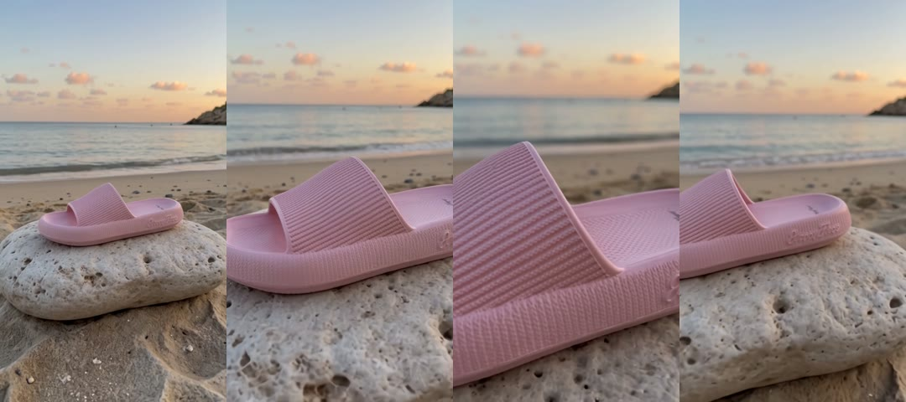
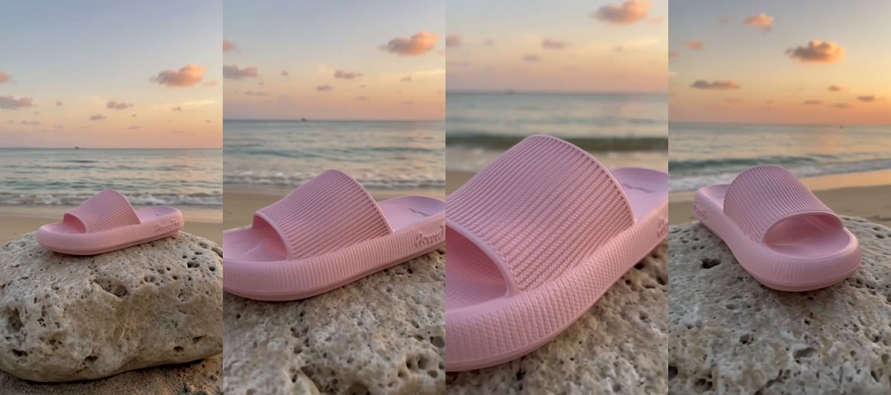
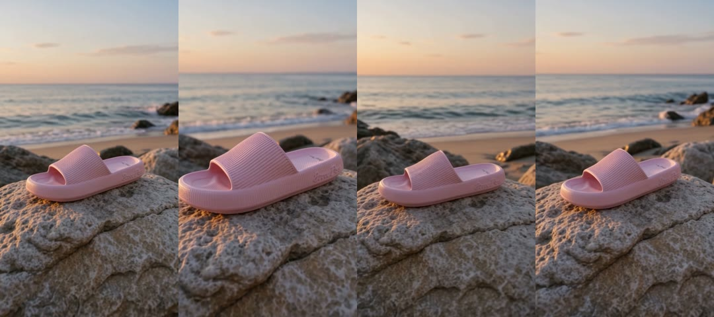
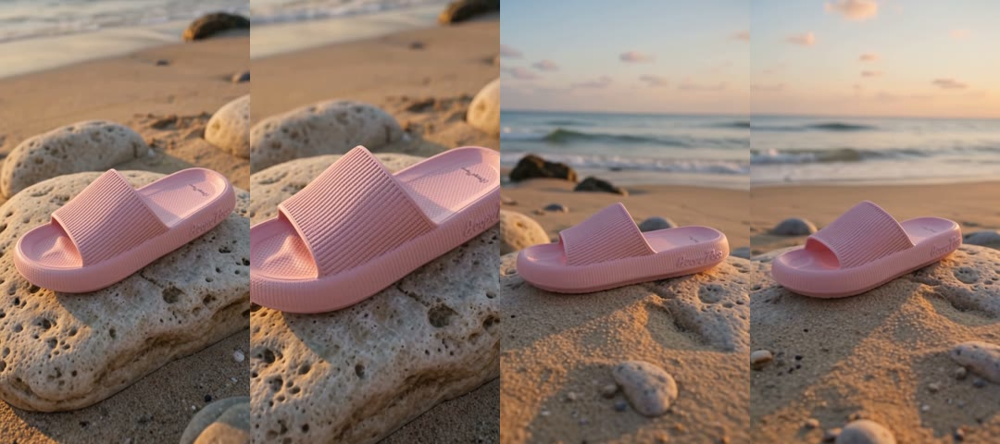
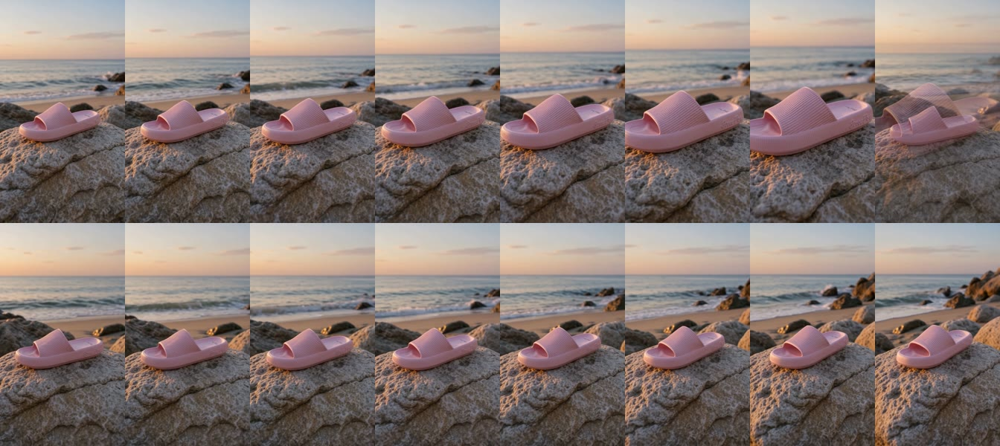
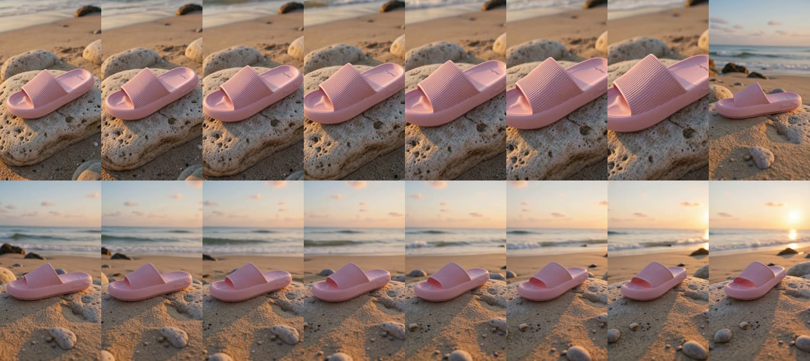

# Investigación: prueba real del director de prompts — `@Imagen N` vs `Image N`, idioma es/en y planos (Wan 3.0, 480p)

Hecha el **20 sep 2026** desde la Mac con las llaves locales (WaveSpeed, Anthropic,
R2), fuera de la base de producción (nada de esto aparece en la pestaña Crear del
cliente). Es la prueba que pedía el spec
`docs/superpowers/specs/2026-09-18-director-prompts-crear-design.md` §12: una misma
idea y una misma referencia, cuatro prompts, cuatro videos con Wan 3.0
(`alibaba/wan-3.0/reference-to-video` vía WaveSpeed, 480p, 8 s, 9:16, sonido
nativo). Costo real: 4 × 0,40 USD de video + 2 llamadas a Claude (≈ 0,02 USD).
Script: `prueba_tokens_idioma.py` (scratchpad de la sesión; usa `flowplus_prompt`,
`director` y `flowplus_modelos` tal como están en `main` `dfc0716`, más el
`flowplus_prompt.py` de antes de la rama, `bc27005`, para la versión «antes»).

## 1. Qué se comparó

| Versión | Cómo se armó el prompt | Qué aísla | Video |
|---|---|---|---|
| V1 «antes» | `flowplus_prompt.armar` de **antes** de la rama (`bc27005`): `@Imagen 1`, `ESCENA:` con el texto tal cual, `SONIDO:` en español, `EVITAR` con «deformaciones» | el comportamiento que producía los videos «horribles» | [V1_antes.mp4](https://pub-6cfed71e83304ff2ae7d0a887b82042a.r2.dev/clientes/happyflops/pruebas/2026-09-20-tokens-idioma/V1_antes.mp4) |
| V2 «tokens» | `armar` de ahora sin director: `Image 1`, cierre `No dialogue. No background music.`, `EVITAR` sin «deformaciones» | solo el cambio de tokens y cierre | [V2_tokens.mp4](https://pub-6cfed71e83304ff2ae7d0a887b82042a.r2.dev/clientes/happyflops/pruebas/2026-09-20-tokens-idioma/V2_tokens.mp4) |
| V3 «director es» | `director.compilar(idioma="es")`: `Shot 1 (0-4s)` macro + `dolly_in`, `Shot 2 (4-8s)` plano general + `orbita_corta`, sonido por plano | el director en español (default) | [V3_director_es.mp4](https://pub-6cfed71e83304ff2ae7d0a887b82042a.r2.dev/clientes/happyflops/pruebas/2026-09-20-tokens-idioma/V3_director_es.mp4) |
| V4 «director en» | igual con `idioma="en"` (mismos dos planos, acciones en inglés) | el idioma | [V4_director_en.mp4](https://pub-6cfed71e83304ff2ae7d0a887b82042a.r2.dev/clientes/happyflops/pruebas/2026-09-20-tokens-idioma/V4_director_en.mp4) |

Referencia: HOriginal Rose de Happy Flops (foto de catálogo `HOriginal - Rose_2.png`,
con el logotipo en relieve en el lateral), guía de marca real (`root.json`, 850
caracteres, en inglés) y su `negative_prompt` (que incluye «logo»). Idea, la misma
en las cuatro: «@Imagen 1 es la sandalia. Está sola sobre una piedra lisa junto al
mar al atardecer; la cámara se acerca despacio a la textura de la correa y luego
rodea la sandalia hasta revelar la playa detrás. Nadie la lleva puesta.» Los cuatro
prompts completos están al final (§6).

Los cuatro videos salieron en 122-141 s cada uno, 480×854, 8,0 s, con pista de
audio. Tiras de 4 fotogramas (0,5 s · 3 s · 5 s · 7,5 s):

| V1 antes | V2 tokens |
|---|---|
|  |  |

| V3 director es | V4 director en |
|---|---|
|  |  |

## 2. Resultado por criterio

| Criterio | V1 antes | V2 tokens | V3 director es | V4 director en |
|---|---|---|---|---|
| Producto fiel (forma, color, correa acanalada, logo en el lateral) | sí | sí | sí | sí |
| Personas / pies / manos no pedidos | ninguno | ninguno | ninguno | ninguno |
| Escena pedida (piedra, mar, atardecer) | sí | sí | sí | sí; en el 2.º plano la piedra pasa a ser arena con piedras (continuidad menor) |
| Estructura | un solo plano continuo: se acerca y vuelve a abrir | igual que V1 | dos planos, pero el cambio a los 4 s es un **fundido con la sandalia semitransparente** (fantasma) | dos planos con **corte limpio** a los ~3,5 s; el segundo abre hacia el mar y el sol |
| Acercamiento a la correa («macro») | moderado | moderado | moderado, nunca macro | el más cercano de los cuatro, tampoco macro |
| Sonido (nivel medio / pico, dBFS) | −30,3 / −13,5 | −30,0 / −13,2 | −25,8 / −8,9 | −28,0 / −10,5 |
| Luz y color de marca (cálido, un tono dominante) | sí | sí | sí | sí |

Tiras densas (un fotograma cada 0,5 s) de las dos versiones con director:





## 3. Lo que dice la prueba (y lo que no)

1. **En un caso fácil, el prompt de antes no era el problema.** Video de solo
   producto, una referencia, 8 s: las cuatro versiones reproducen el producto y la
   escena. Los videos «horribles» que motivaron el spec eran de 10-30 s con
   personas; esa condición no se probó aquí (ver §5).
2. **`@Imagen 1` vs `Image 1`: sin diferencia visible con una sola referencia.**
   Con una imagen el modelo la usa sea cual sea el nombre. La diferencia solo puede
   aparecer con varias referencias (qué imagen es el producto y cuál el entorno);
   queda para otra prueba. El cambio de token se mantiene porque es lo que documenta
   Alibaba y no cuesta nada.
3. **El director sí cambia la estructura: dos planos en vez de un plano continuo, y
   sonido más presente** (5-6 dB más en las dos versiones con sonido descrito por
   plano). Pero **sin decir cómo se pasa de un plano al otro, Wan improvisa**: en V3
   hizo un fundido con fantasma (defecto visible), en V4 un corte limpio. Los dos
   planes eran iguales salvo el idioma, así que la diferencia es azar del modelo, no
   del idioma. La guía oficial de Wan para multi-shot escribe literalmente
   «Hard cut transition» al empezar el segundo plano
   (`alibabacloud.com/help/en/model-studio/text-to-video-prompt`, fórmula
   multi-shot), y la guía de Seedance de Higgsfield pide «hard cuts only». Nuestro
   bloque `Shot N` no lo decía.
4. **Idioma: n = 1 por condición, no concluye.** V4 (inglés) fue el mejor de los
   cuatro, pero con una sola muestra y un plan idéntico no se puede atribuir al
   idioma. A favor del inglés: la guía de marca de Happy Flops ya está en inglés, y
   con `idioma_prompt=en` el prompt queda casi homogéneo. En contra: en V4 las
   líneas `Shot` mezclan inglés (acción) y español (fraseo de cámara del vocabulario
   cerrado `CAMARAS`, que solo existe en español hasta la Etapa 2, cuyos presets
   traen `fraseo {es, en}`).
5. **Tensión preexistente en las cuatro:** el `negative_prompt` de marca incluye
   «logo» mientras `PRODUCTO EXACTO` pide reproducir el logotipo tal como aparece.
   El logo salió bien en las cuatro, así que Wan resolvió a favor del positivo, pero
   conviene quitar «logo» del negativo de `root.json` de Happy Flops.

## 4. Decisiones que salen de aquí

- **Corte explícito entre planos** (hecho el mismo día, commit posterior a esta
  nota): `flowplus_prompt._bloque_planos` antepone `Hard cut.` a cada `Shot N` a
  partir del segundo, con la frase literal de la guía de Wan, igual que el cierre de
  sonido. Es lo único que la prueba demuestra que falta.
- **`idioma_prompt` sigue en `es` por defecto** (se lee mejor y la prueba no lo
  desmiente). Para Happy Flops, cuya guía de marca está en inglés, vale la pena
  poner el proyecto en `en` desde FlowSettings y comparar en la próxima tanda.
- **Quitar «logo» del `negative_prompt`** de `clientes/happyflops/marca/root.json`
  (archivo del cliente, no viaja por git: se edita a mano en la Mac y en el VPS).

## 5. Qué NO se probó (siguiente tanda, misma mecánica)

- La condición que originó la queja: **persona con el producto puesto, 12-15 s**,
  con un personaje del catálogo (3 vistas) y el producto: ahí es donde se esperan
  pies deformes y cambios de producto, y donde el director (planos cortos, un
  movimiento por plano) debería ayudar más.
- **Varias referencias** (producto + entorno + logo) para ver si `Image N` evita
  confusiones que `@Imagen N` no evitaba.
- **Repetición** (2-3 muestras por condición) para separar idioma de azar.
- Kling O3 Pro y Seedance 2.5 (la prueba fue solo Wan).

## 6. Prompts completos

### V1 antes (1 856 caracteres)

```
VIDEO DE PRODUCTO SOLO, SIN NINGUNA PERSONA: el producto aparece vacío, sin usar, sobre la superficie o flotando. Nadie lo lleva puesto. No hay pies, piernas, manos ni cuerpo en ningún momento del video, ni al principio ni al final.
PRODUCTO EXACTO: @Imagen 1 es el producto "HOriginal — Rose". Reprodúcelo idéntico a su referencia: misma forma, mismo color, misma textura y el mismo logotipo o marca tal como aparece, en el mismo lugar. No inventes ni cambies letras, logos ni etiquetas.
ESTILO DE MARCA: Light is soft and directional — never flat, never harsh, never flash. The source is always readable. Colour is rich but credible: about 10-15% more saturated than reality, still possible as a photograph. The frame resolves to ONE dominant tone and ONE accent, graded warm. Styling is simple and comfortable and never competes with the product. The product matches the reference image exactly. Feeling over perfection: warm, alive, slightly imperfect.
ESCENA: @Imagen 1 es la sandalia. Está sola sobre una piedra lisa junto al mar al atardecer; la cámara se acerca despacio a la textura de la correa y luego rodea la sandalia hasta revelar la playa detrás. Nadie la lleva puesta.
SONIDO: ambiente natural de la escena. Sin diálogo hablado ni música de fondo.
EVITAR: personas, pies, manos, texto inventado, logos inventados, marcas de agua, subtítulos, deformaciones, extra toes, missing toes, six toes, fused toes, merged toes, splayed toes, curled toes, gripping toes, tense toes, deformed feet, malformed foot anatomy, extreme toe close-up, dirty feet, cracked skin, dry skin, calluses, long toenails, coloured nail polish, veiny feet, text, lettering, words, logo, watermark, signage, captions, gym, fitness equipment, office, desk, workplace, hospital, clinical s.
Recordatorio final: el producto permanece solo y sin nadie durante todo el video.
```

### V2 tokens (1 871 caracteres)

Igual que V1 salvo: `PRODUCTO EXACTO: Image 1 es el producto…`, `ESCENA: Image 1 es
la sandalia…`, la línea `SONIDO:` termina en `No dialogue. No background music.` y
`EVITAR` no lleva «deformaciones».

### V3 director es (2 343 caracteres)

Bloques fijos iguales a V2; en lugar de `ESCENA:`/`SONIDO:`:

```
Shot 1 (0-4s): macro, la cámara avanza en línea recta hacia el sujeto, despacio y a velocidad constante, sin zoom. La cámara avanza muy despacio hacia la correa de HOriginal — Rose (Image 1), revelando la textura del material y el logotipo tal como aparece en la referencia, mientras la luz cálida del atardecer roza la superficie de la piedra lisa. Sonido: Olas suaves rompiendo a lo lejos, viento ligero rozando la piedra.
Shot 2 (4-8s): plano general, la cámara rodea al sujeto en un arco corto de menos de 45 grados. La cámara gira lentamente menos de 45 grados alrededor de HOriginal — Rose (Image 1), sola sobre la piedra, hasta dejar ver la playa y el mar al atardecer detrás de ella; nadie la lleva puesta. Sonido: Rumor constante del mar, brisa suave entre las rocas.
No dialogue. No background music.
```

### V4 director en (2 346 caracteres)

```
Shot 1 (0-4s): macro, la cámara avanza en línea recta hacia el sujeto, despacio y a velocidad constante, sin zoom. The camera slowly pushes toward the woven strap of HOriginal — Rose (Image 1), resting alone on the smooth rock, revealing the fine texture, stitching, and logotype as golden sunset light rakes across the material. Sonido: Soft waves lapping in the distance, a light breeze brushing over stone, faint gull calls.
Shot 2 (4-8s): plano general, la cámara rodea al sujeto en un arco corto de menos de 45 grados. The camera arcs gently less than 45 degrees around HOriginal — Rose (Image 1), pulling back to reveal the empty beach and glowing horizon behind the sandal, no one nearby. Sonido: Waves rolling steadily onto the shore, wind moving softly across the beach.
No dialogue. No background music.
```

## 7. Qué NO se pudo confirmar

- Que el fundido de V3 sea reproducible: con una muestra no se sabe si Wan funde
  siempre que falta la instrucción de corte o solo a veces.
- El sonido se midió por nivel (ffmpeg `volumedetect`), no escuchado: «más
  presente» no significa «mejor».
- Nada sobre Kling O3 Pro ni Seedance 2.5.
